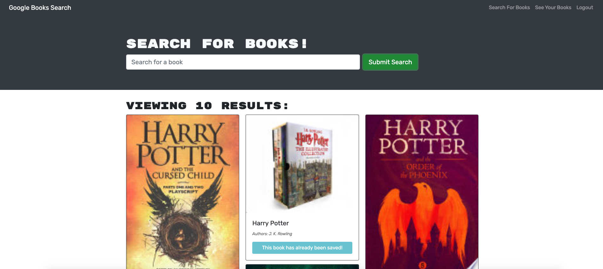

# book-club

  ## Description

 This a MERN stack project that allows you to search for books using Google's book API.  Once you create an account, you can save books to your list and then delete them when youa re finished.

 
  
To view the live page:  [Click Here](https://peaceful-fjord-06561.herokuapp.com/)

  ## Table of Contents
  
  * [Installation](#installation)
  * [Usage](#usage)
  * [Contributing](#contributing)
  * [Testing](#testing)
  * [License](#license)
  * [Questions](#questions)
  
  ## Installation

  To use this repo on your local machine, you will need Node.js.  After cloning the code to your local device, be sure to run `node npm install` to include essential npm packages.
  
  ## Usage 

On load, the website will show the main landing page.  From here you can search for books using the search bar.  Click sign up to create an account, or login to log back into your created account.  This will allow you to click `Save Book` on any books you like.  You can then view your saved books by clicking `See Your Books`, and also delete books from your list using the `Delete This Book` button.

  
  ## Contributing

 Please reach out via email if you wish to contribute (see questions section below)
  
  ## Testing

  No testing currently.
  
  ## License

  
  
  ## Questions
  
  * GitHub: [@fancibleunicorn](https://github.com/fancibleunicorn)
  * Email: adamcrandall91@gmail.com
